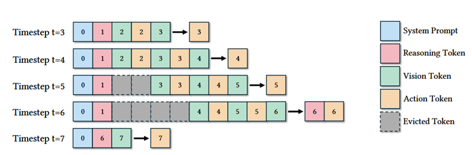

# 项目作业：大语言模型记忆功能的设计与实现

## 背景

大语言模型（Large Language Models, LLMs）在当前的人工智能应用中展现出强大的能力，但它们本质上是无状态的系统。这意味着：
- 每次接收到prompt时，模型都会独立生成回复
- 不会自动参考用户的历史对话内容
- 无法记住用户表达过的偏好、背景信息或历史交互
- 缺乏持续学习和上下文积累的能力
- 
这种无状态特性限制了模型在实际应用中的效果。例如，用户需要在每次对话中重复提供相同的背景信息，模型无法根据用户的历史行为进行个性化响应；模型之前犯过的错，如果反馈没有加入记忆，下一次还是会重复犯错。

现在有很多方法试图为大语言模型加上记忆模块，例如基于将历史消息拼接到提示词中、检索增强生成、cheatsheet（[Dynamic Cheatsheet: Test-Time Learning with Adaptive Memory](https://arxiv.org/abs/2504.07952)）、新的模型架构（[Titans: Learning to Memorize at Test Time](https://arxiv.org/abs/2501.00663)）等等。基于上下文的记忆模式也带来了问题：当记忆信息太多时，会影响模型的推理速度，还可能引入无关信息。为了解决这个问题，上下文滑动窗口限制了上下文的长度，只看最近的记忆。此外还有很多其他的记忆管理方式。

## 实施步骤

你可以按照以下步骤开展研究：
1.	理解大语言模型记忆功能为什么是重要的？记忆模块的设计和实现面临哪些挑战？
2.	调研当前主流的记忆功能实现方案，这些方案分别是基于什么的，分为几大类？不同记忆机制的优劣和适用场景分别是什么？
3.	设计实现一个集成记忆功能的LLM/Agent
4.	评估你实现的记忆模块和其他记忆机制的差异，这里可以设计对比实验(评估指标可以参考现有文献)
5.	分析你得到的实验结果，推荐使用wandb可视化分析工具；必要时可以设计消融实验。我们鼓励大胆地尝试，实验结果不是sota没关系，重要的是分析结果产生的原因，可以记录失败的尝试~

### 评分标准

**总分：100 分**

| 评分项 | 分值 | 评分细则 |
| --- | --- | --- |
| **文献调研** | 25分 | 报告中的Introduction和Related work 部分的全面性(15分)、分析的深度(10分) |
| **方法实现** | 34分 | 方法创新性(10分)、代码质量(12分)、技术难度(12分) |
| **实验评估** | 26分 | 实验设计合理性(10分)、结果分析深刻程度(10分)、优秀的图表展示(6分) |
| **报告撰写** | 15分 | 逻辑清晰(5分)、表达准确(5分)、格式规范(5分) |

### 四、 参考资料

【wandb 教程】 [https://docs.wandb.ai/models/quickstart](https://docs.wandb.ai/models/quickstart)